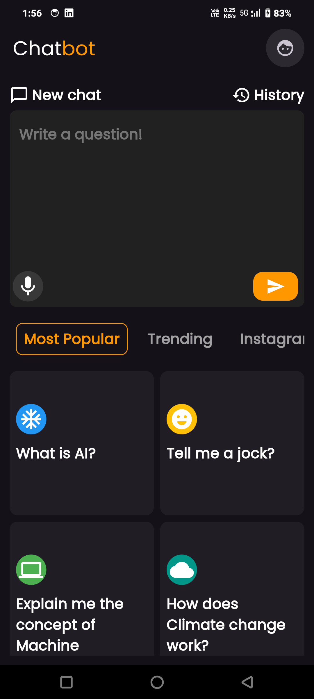
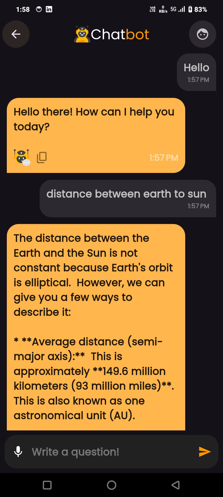

# Chat Bot App

A Flutter-based Chat Bot application that delivers intelligent AI-powered conversations with smooth animations and a clean user interface.  
It uses **AnimatedTextKit** to simulate human-like typing behavior and integrates with the **Google Gemini API** to generate smart and natural responses in real time.

This app demonstrates how conversational AI can be integrated into a mobile environment using Flutter, with focus on simplicity, responsiveness, and usability.

---

## Features

- Real-time chat with AI-generated responses  
- Animated typing effect for bot messages  
- Local message history storage  
- Dark and light mode support  
- Clean, user-friendly design with smooth animations  

---

## Screenshots

<div align="center">
  
  
  
</div>

---

## Installation

### Clone and Run the App
```bash
# 1. Clone the repository
git clone https://github.com/yourusername/chat-bot-app.git
cd chat-bot-app

# 2. Install dependencies
flutter pub get

# 3. Run the app
flutter run
```

---

## API Integration

This app uses the **Google Gemini API** for AI-generated responses.  
Follow these steps to connect your API key:

1. Create a project and API key in **Google Cloud Console**.  
2. Open the following file in your project:

   ```
   lib/data/remote/api_helper.dart
   ```

3. Add your API key:
   ```dart
   const String apiKey = "YOUR_API_KEY";
   ```

---

## Dependencies

The main dependencies used in this project are:

- **Flutter** – For building the cross-platform UI  
- **Provider** – For state management  
- **AnimatedTextKit** – For typing animation effects  
- **Intl** – For date and time formatting  

---

## Contributing

Contributions are welcome!  
If you’d like to add features or fix bugs, please follow these steps:

1. Fork the repository  
2. Create a new feature branch  
3. Commit your changes  
4. Push to your fork  
5. Open a pull request  

For significant changes, please open an issue first to discuss what you’d like to modify.

---

## Acknowledgment

Made with Flutter to showcase how AI and UI can come together beautifully in one simple mobile app.
